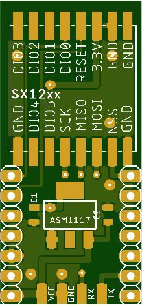
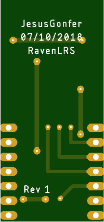

# Rx Slim Rev1 (No Tested)

Este receptor es el mas pequeño que he creado hasta la fecha, siendo asi perfecto para drones de carreras tipo autobus y alas.
Esta version no cuenta con oled, por lo que no podremos visualizar los datos como en los receptores genericos de RavenLRS.  
**Este hardware todavía no ha sido probado**

 
 
 

## Listado de componentes
Ya que este proyecto es realizado en mis tiempos libre y no recivo remuneracion economica por ello, los enlaces de aliexpress llevan un enlace de afiliado, donde me dan una pequeña comision de los productos que se compren atrasves de ellos, porfavor usalos para que este proyecto siga adelante
 ### --- 433Mhz ---
 [Sx1278](https://github.com/user/repo/blob/branch/other_file.md): Emisor Lora 433Mhz con ufl incorporado.  
 [Esp32](https://github.com/user/repo/blob/branch/other_file.md): Procesador Esp32 con adaptador usb. (Sin oled)  
 [PinHead](https://github.com/user/repo/blob/branch/other_file.md): Pines para unir la pcb con el procesador.  
 [Condensador 1](https://github.com/user/repo/blob/branch/other_file.md): Condensadores 10uf.  
 [Condensador 2](https://github.com/user/repo/blob/branch/other_file.md): Condensadores 47uf.  
 [AMS1117](https://github.com/user/repo/blob/branch/other_file.md): Regulador 3v3.  
 **Tabien tendras que comprar las pcb.**

